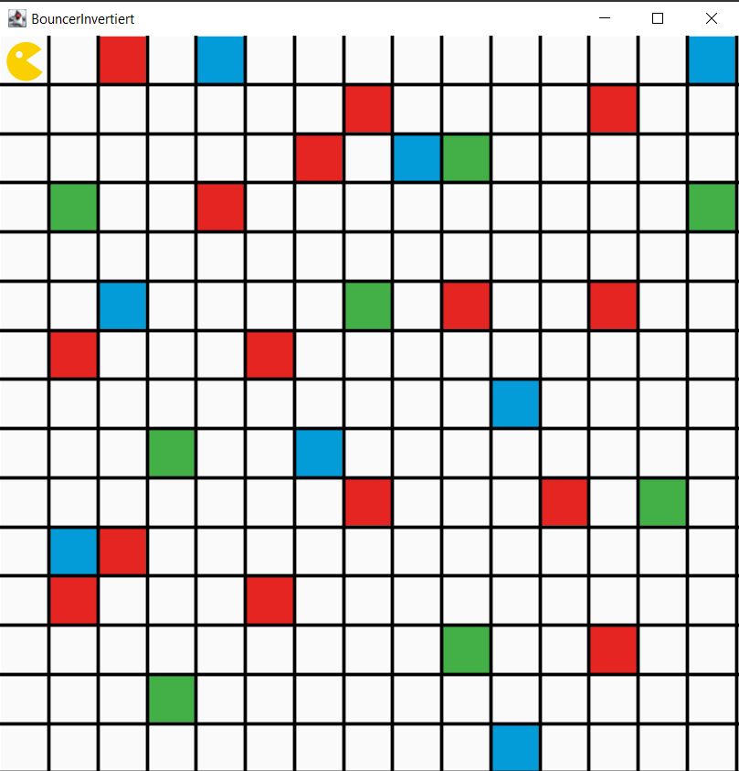
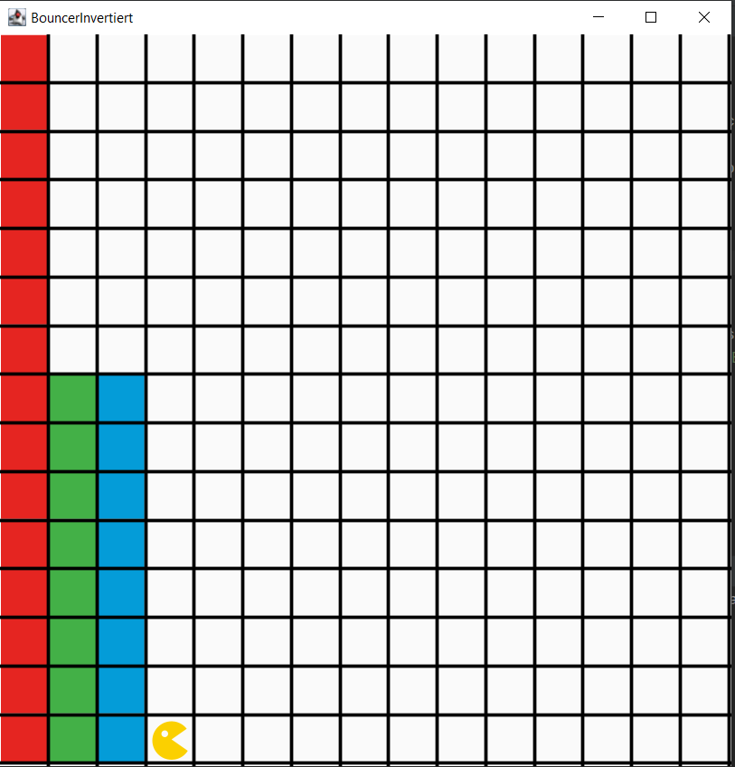
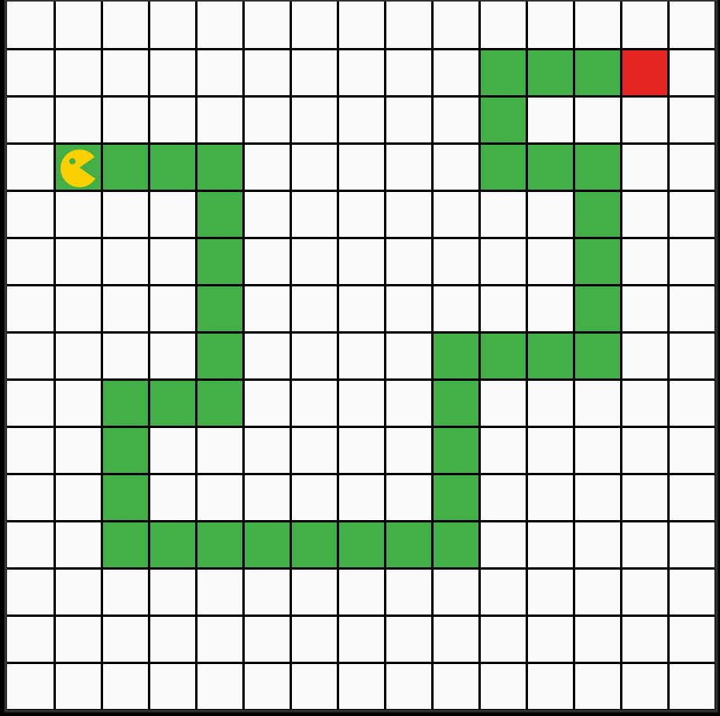
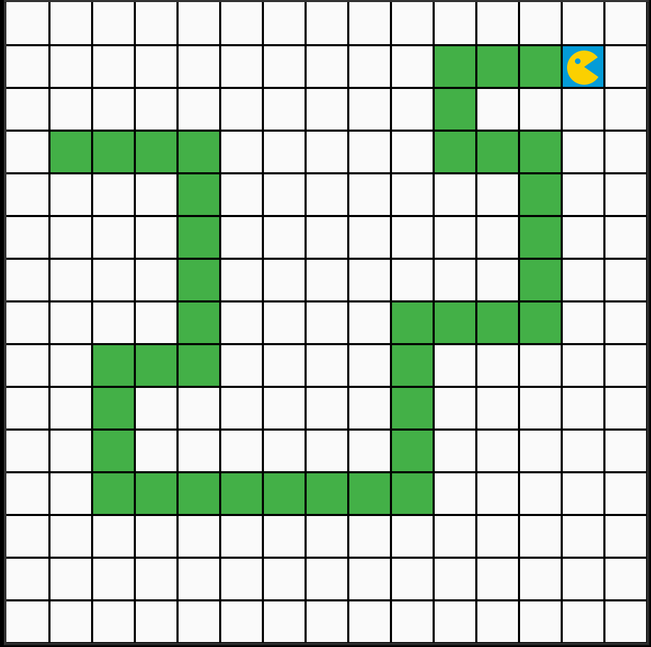
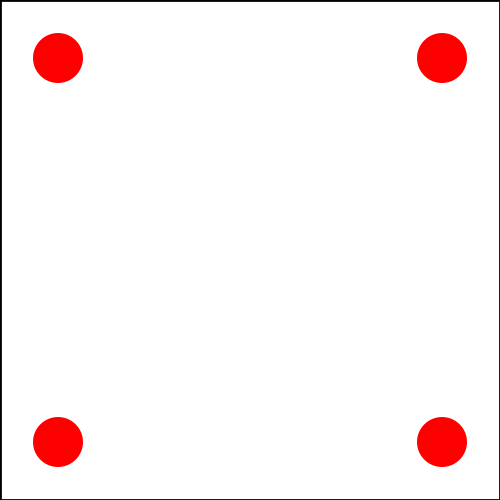
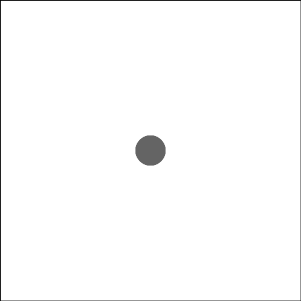

# Template für Übungsaufgaben 

## Allgemeine Hinweise zur Studienleistung
In dieser Studienleistung werden Sie mehrere Programmieraufgaben lösen. Um die Aufgaben zu bearbeiten,
müssen Sie zuerst das Projekt OOP-Studienleistung-WS20-01-Starterpaket.zip in IntelliJ öffnen. **Nutzen Sie zum Lösen der einzelnen Aufgaben die bereitgestellten Klassendateien.** Zum Einreichen Ihrer Aufgaben nutzen Sie die entsprechende Funktion in GRIPS. Falls Sie Problemen mit dem Starterpaket oder dem
Einreichen der Aufgabe haben, können Sie sich in den Handouts auf GRIPS informieren.

**Achtung:** Eine Verlängerung der Abgabefrist ist nicht möglich. Einreichungen die uns (zu spät) per E-Mail
erreichen, werden nicht mehr berücksichtigt. Alle nicht eingereichten Aufgaben werden mit nicht bestanden
bewertet. Testen Sie den Upload am besten schon vor Ablauf der Frist in Ruhe: Sie können bis zum
Abgabetermin beliebig viele neue Lösungen einreichen.

**Bewertungskriterien:** Für die gesamte Studienleistung gilt, dass die eingereichten Lösungen nur die in der
Aufgabenstellung beschriebenen Probleme lösen sollen. Lassen Sie keinen Teil der jeweiligen Aufgabe weg und
interpretieren Sie die Fragestellung nicht selbstständig. Bewertet wird, in wie weit Sie das beschriebene
Problem vollständig lösen. Wenn Sie die Aufgaben erfolgreich bearbeitet haben, können Sie Ihre Lösung gerne
kreativ gestalten und erweitern; achten Sie dabei darauf, dass die eigentlichen Anforderungen weiterhin erfüllt
bleiben.  
Die Qualität Ihres Codes fließt in die Gesamtnote mit ein: Nutzen Sie Decomposition um Ihre Programme
übersichtlich zu gestalten. Verwenden Sie sinnvolle Bezeichner für Variablen und Methoden und kommentieren
Sie ausreichend. Beachten Sie dazu die Kriterien für guten und schlechten Code, die in der Vorlesung erwähnt
wurden.

## Starterpaket

Ein vorbereitetes Starterpaket zur selbständigen Implementierung der Aufgabe finden Sie [hier](https://github.com/OOP-Ubungen-WS2020-21/Studienleistung-01/archive/Starterpaket.zip).

## Aufgabe 1: Bouncer cleans
In der ersten Aufgabe soll Bouncer Chaos beseitigen, indem er die bunten Kacheln aufsammeln und nach Farbe sortiert.  
Dabei soll Bouncer die Karte ablaufen und prüfen, ob er auf einem farbigen Feld steht und dies gegebenenfalls weiß einfärben.  

{ width=50% }  

{ width=50% } 

Am Ende sollen die gesammelten Kacheln sortiert am unteren Ende der Karte wieder aufgestapelt werden.
Hierfür zählt Bouncer - während er die Kacheln einsammelt - für jede der drei Farben mit, wie viele er eingesammelt hat.
Bouncer startet einen neuen Stapel für Kacheln gleicher Farbe, wenn er diese nicht in eine Spalte passen.
Bouncer macht das so lange, bis alle Kacheln dieser Farbe einsortiert sind.
Erst dann beginnt Bouncer die Stapel der anderen Farben zu bauen.

Achten Sie darauf, dass Ihre Lösung für beliebig auf der Karte verteilte Kacheln gilt.
Sie können überprüfen, ob Ihre Lösung dieser Vorgabe entspricht, indem Sie die im Starterpaket mitgelieferte
zweite Karte Mess2.xml laden und mit Ihrem Code testen.  
  
**Hilfsmethoden:** Legen Sie eigenständig Methoden an, die Ihnen dabei helfen, häufig auftretende Bewegungsabläufe von Bouncer auszulagern.  
  
## Aufgabe 2: Path of Bouncer
In der zweiten Aufgaben soll Bouncer einen Weg entlang gehen, der durch grüne Felder gekennzeichnet ist.
Das soll Bouncer so lange tun, bis er das rote Zielfeld erreicht.
Sollte Bouncer vom Weg abkommen, kehrt er zurück zur letzten bekannten Kachel des Weges und versucht in eine andere Richtung zu gehen.

{ width=50% }

Am roten Zielfeld angekommen, färbt Bouncer das Feld blau, um seinen Erfolg zu feiern.

{ width=50% }

Achten Sie darauf, dass Ihre Lösung für beliebige Pfade innerhalb der Karte funktioniert.
Sie können überprüfen, ob Ihre Lösung dieser Vorgabe entspricht, indem Sie die im Starterpaket mitgelieferte
zweite Karte Labyrinth2.xml laden und mit Ihrem Code testen.

Für den Pfad gelten folgende Bedingungen:
- Der Pfad ist immer grün und das Zielfeld ist immer rot
- Bouncer startet immer am Anfang des Pfades
- Der Pfad verläuft nie entlang der Kante von Bouncers Welt
- Der Pfad überschneidet sich nie
- Der Pfad hat keine Hindernisse
- Der Pfad ist immer anhand mindestens eines weißen Feldes getrennt (zu sehen rechts oben im Beispielbild).

**Decomposition:** Überlegen sie sich im Vorfeld genau auf welche Teilprobleme Sie stoßen werden, um diese Aufgabe zu lösen.
Denken Sie darüber nach, mit welchen Befehlen sie Bouncer entlang des Weges schicken können.
Das ist besonders bei den Kurven wichtig.
Legen Sie entsprechende eigene Methoden dafür an.

## Aufgabe 3: GraphicsApp - Meeting Circles

Für die Lösung der 3. Aufgabe sollen Sie vier Kreise in einer quadratischen Zeichenfläche platzieren und dann so animieren, damit sie sich in der Mitte treffen.
Die vier Kreise haben den gleichen festen Radius und die gleiche Farbe.
Die Kreise sollen in den Ecken der Zeichenfläche platziert werden, damit sich deren Mittelpunkte auf den entsprechenden Diagonalen der Zeichenfläche befinden.
Danach sollen sich die Kreise mit gleicher und konstanter Geschwindigkeit entlang der Diagonalen in die Mitte bewegen und gleichzeitig am Mittelpunkt ankommen.
Sobald die Kreise am Mittelpunkt angekommen sind, sollen sie sich grau färben.

- Die Zeichenfläche soll quadratisch sein (z.B. 500x500)
- Die Kreise sollen innerhalb der Zeichenfläche in den jeweiligen Ecken platziert werden, damit sich deren Mittelpunkte auf einer Diagonale der Zeichenfläche befinden 
- Die Kreise sollen sich mit gleicher Geschwindigkeit den Mittelpunkt nähern und diesen gleichzeitig erreichen
- Am Mittelpunkt angekommen, sollen sich die Kreise grau färben
- Achten Sie darauf, dass Sie jeden Kreis nur einmalig instantiieren  

**Variablen** Zur Bearbeitung dieser Aufgabe benötigen Sie Variablen und Konstanten, mit deren Hilfe sie Koordinaten berechnen werden.

{ width=50% }

{ width=50% }

