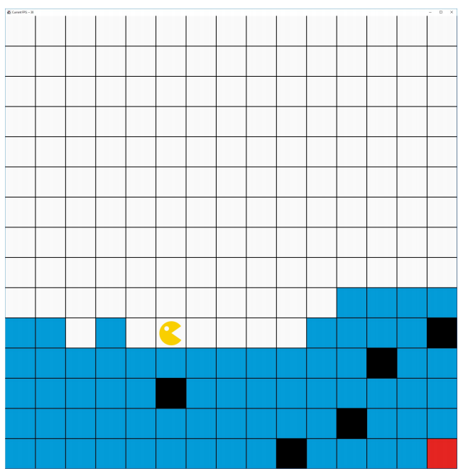

# Template für Übungsaufgaben 

## Allgemeine Hinweise zur Studienleistung
In dieser Studienleistung werden Sie mehrere Programmieraufgaben lösen. Um die Aufgaben zu bearbeiten,
müssen Sie zuerst das Projekt OOP-Studienleistung-WS20-01-Starterpaket.zip in IntelliJ öffnen. **Nutzen Sie zum Lösen der einzelnen Aufgaben die bereitgestellten Klassendateien.** Zum Einreichen Ihrer Aufgaben nutzen Sie die entsprechende Funktion in GRIPS. Falls Sie Problemen mit dem Starterpaket oder dem
Einreichen der Aufgabe haben, können Sie sich in den Handouts auf GRIPS informieren.

**Achtung:** Eine Verlängerung der Abgabefrist ist nicht möglich. Einreichungen die uns (zu spät) per E-Mail
erreichen, werden nicht mehr berücksichtigt. Alle nicht eingereichten Aufgaben werden mit nicht bestanden
bewertet. Testen Sie den Upload am besten schon vor Ablauf der Frist in Ruhe: Sie können bis zum
Abgabetermin beliebig viele neue Lösungen einreichen.

**Bewertungskriterien:** Für die gesamte Studienleistung gilt, dass die eingereichten Lösungen nur die in der
Aufgabenstellung beschriebenen Probleme lösen sollen. Lassen Sie keinen Teil der jeweiligen Aufgabe weg und
interpretieren Sie die Fragestellung nicht selbstständig. Bewertet wird, in wie weit Sie das beschriebene
Problem vollständig lösen. Wenn Sie die Aufgaben erfolgreich bearbeitet haben, können Sie Ihre Lösung gerne
kreativ gestalten und erweitern; achten Sie dabei darauf, dass die eigentlichen Anforderungen weiterhin erfüllt
bleiben.  
Die Qualität Ihres Codes fließt in die Gesamtnote mit ein: Nutzen Sie Decomposition um Ihre Programme
übersichtlich zu gestalten. Verwenden Sie sinnvolle Bezeichner für Variablen und Methoden und kommentieren
Sie ausreichend. Beachten Sie dazu die Kriterien für guten und schlechten Code, die in der Vorlesung erwähnt
wurden.

## Starterpaket

Ein vorbereitetes Starterpaket zur selbständigen Implementierung der Aufgabe finden Sie [hier](https://github.com/OOP-Ubungen-WS2020-21/Studienleistung-01/archive/Starterpaket.zip).

## Aufgabe 1: Bouncer räumt auf
In der ersten Aufgabe soll Bouncer Chaos beseitigen, indem er die bunten Kacheln aufsammeln und nach Farbe sortiert.  
Dabei soll Bouncer die Karte ablaufen und prüfen, ob er auf einem farbigen Feld steht und dies gegebenenfalls weiß einfärben.  

{ width=50% }  

{ width=50% } 

Am Ende sollen die gesammelten Kacheln sortiert am unteren Ende der Karte wieder aufgestapelt werden.
Hierfür zählt Bouncer - während er die Kacheln einsammelt - für jede der drei Farben mit, wie viele er eingesammelt hat.
Sollte Bouncer mehr als 15 Kacheln einer Farbe aufgenommen haben, so startet er einen neuen Stapel rechts neben des ersten Stapels der Kacheln dieser Farbe, bevor er Stapel anderer Farben beginnt.

Achten Sie darauf, dass Ihre Lösung für beliebig auf der Karte verteilte Kacheln gilt.
Sie können überprüfen, ob Ihre Lösung dieser Vorgabe entspricht, indem Sie die im Starterpaket mitgelieferte
zweite Karte Mess2.xml laden und mit Ihrem Code testen.  
  
**Hilfsmethoden:** Legen Sie eigenständig Methoden an, die Ihnen dabei helfen, häufig auftretende Bewegungsabläufe von Bouncer auszulagern.  
  

## Aufgabe 2: Bouncer gräbt Tunnel
Die zweite Aufgabe ist anspruchsvoller: am unteren Rand der Karte ist ein wichtiger Rohstoff auf einem roten
Feld deponiert. Bouncer muss sich durch die blaue Erde graben und dabei hartem Felsgestein ausweichen, um
dorthin zu gelangen und den Rohstoff aufzusammeln indem er das Feld weissfärbt.  
Finden Sie einen Weg, wie Sie Bouncer nach unten steuern können. Dabei müssen Sie darauf achten, dass der
Rohstoff auf einem beliebigen Feld am unteren Rand liegen kann. Die Hindernisse am unteren Rand können
maximal ein Feld hoch sein.  
Bouncer sollte diese Aufgabe für verschiedene Karten lösen können. Sie können überprüfen, ob Ihre Lösung
dieser Vorgabe entspricht, indem Sie die im Starterpaket mitgelieferte zweite Karte Tunnel2.xml laden und mit
Ihrem Code testen. Folgende Annamen gelten:
- Die Karte ist immer in zwei Bereiche getrennt: Luft (Weisse Felder) und Erde (blaue Felder).
- Innerhalb der blauen Felder können Hindernisse (schwarze Felder) liegen - Diese liegen nie an der Oberfläche.
- Die Hindernisse haben immer einen Abstand von mind. einem Feld untereinander.
- Sollten Hindernisse am unteren Rand liegen, sind diese maximal ein Feld groß.
- Der zu findende Rohstoff (rotes Feld) ist immer ein Feld groß und liegt immer am unteren Rand der Karte.  

**Vorgehen:** Die gestellte Aufgabe ist nicht trivial. Der Schlüssel zur Lösung liegt in einer sorgfältigen Analyse des
Problems, der sinnvollen Strukturierung des Programms und einer korrekten Abarbeitung der unterschiedlichen
Fälle die bei einer Entscheidung während der Wegfindung nötig sind. Wie bei den bisherigen Bouncer-Aufgaben
wird es darauf ankommen, dass Sie die elementare Aufgabe identifizieren, die Bouncer solange wiederholen
muss, bis das Programm einen bestimmten Endzustand (hier: Bouncer steht auf dem roten Feld und färbt es
weiss) erreicht hat. Als Hilfestellung dienen die folgende Fragen, die Sie sich zu Beginn der Bearbeitung stellen
sollten.
- Wann ist das komplette Problem gelöst?
- Wie sieht der zu erreichende Endzustand aus und wie lässt sich im Programm prüfen ob dieser Zustand
eingetreten ist?
- Was muss wiederholt erledigt werden um den Hindernissen auszuweichen?
- Welche Informationen über die aktuelle Umgebung müssen eingeholt werden um eine sinnvolle
Entscheidung zu treffen?  

Beginnen Sie mit der Lösung eines kleinen Teilproblems, z.B. damit, Bouncer sich so lange dreht, bis er nach
unten schaut. Nehmen Sie sich dann den nächsten Schritt vor: Bouncer bewegt sich so lange nach unten, bis er
ein blaues Feld erreicht. Im weiteren Schritt färben Sie dieses Feld weiss und steigen weiter ab.  
Es könnte sinnvoll sein, das Problem generell in zwei Schritte zu teilen: Zuerst an den unteren Rand gelangen,
dann den Rohstoff suchen. Indem Sie sich auf kleine, gut durchführbare Teilprobleme konzentrieren, machen
Sie das Gesamtproblem handhabbar. 

{ width=50% }  

## Aufgabe 3: GraphicsApp - Meeting Circles

Für die Lösung der 3. Aufgabe sollen Sie vier Kreise in einer quadratischen Zeichenfläche platzieren und dann so animieren, damit sie sich in der Mitte treffen.
Die vier Kreise haben den gleichen festen Radius und die gleiche Farbe.
Die Kreise sollen in den Ecken der Zeichenfläche platziert werden, so dass sich deren Mittelpunkte auf den entsprechenden Diagonalen der Zeichenfläche befinden.
Danach sollen sich die Kreise mit gleicher und konstanter Geschwindigkeit entlang der Diagonalen in die Mitte bewegen und gleichzeitig am Mittelpunkt ankommen.
Sobald die Kreise am Mittelpunkt angekommen sind, sollen sie sich grau färben.

- Die Zeichenfläche soll quadratisch sein (z.B. 500x500)
- Die Kreise sollen innerhalb der Zeichenfläche in den jeweiligen Ecken platziert werden, so dass sich deren Mittelpunkte auf einer Diagonale der Zeichenfläche befinden 
- Die Kreise sollen sich mit gleicher Geschwindigkeit den Mittelpunkt nähern und diesen gleichzeitig erreichen
- Am Mittelpunkt angekommen, sollen sich die Kreise grau färben
- Achten Sie darauf, dass Sie jeden Kreis nur einmalig instantiieren  

{ width=50% }

{ width=50% }

